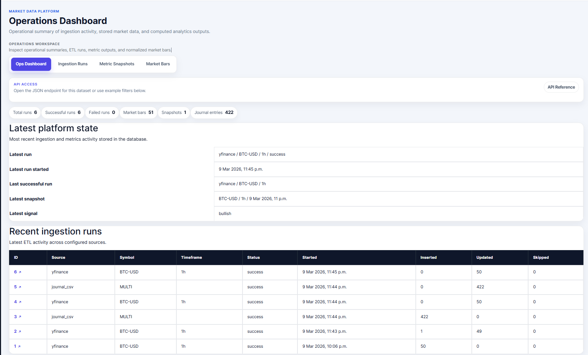
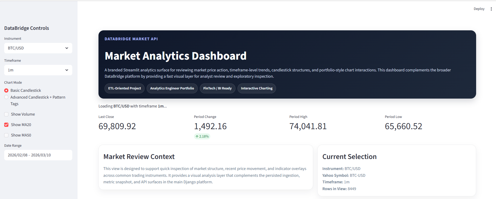

# DataBridge Market API

> A production-minded Django data product for multi-source market data ingestion, normalized analytics storage, ETL workflow management, and read-only API delivery — built as a portfolio project for Analytics Engineer and Data Engineer roles.

---

## Screenshots

| Homepage Dashboard | Operations Dashboard |
|---|---|
|  |  |

| API Reference | Streamlit Dashboard |
|---|---|
|  |  |

---

## What this project demonstrates

This is not a live-market demo app. It is a structured data product designed to show end-to-end workflow thinking across the full data engineering stack.

```
source ingestion → normalized storage → metric computation → operational visibility → API delivery → portfolio presentation
```

**Skills evidenced:**

- Multi-source provider integration (yfinance, ccxt, TwelveData)
- ETL workflow design with repeatable management commands
- Normalized relational model design for downstream analytics
- Metrics computation (returns, volatility, moving averages, crossover signals)
- Read-only API delivery with filtering and human-readable reference docs
- SaaS-style operational monitoring UI
- Portfolio packaging for recruiter review

**Target roles:** Analytics Engineer · Data Engineer (Junior / Integration) · FinTech Analytics · Reporting Engineer · Python / Django data-product roles

---

## Architecture

```
Provider Clients       Service Layer          Normalized Models
──────────────────     ──────────────────     ──────────────────────────────────
yfinance               ingestion.py           IngestionRun
ccxt               →   journal_import.py  →   MarketBar
TwelveData             metrics.py             MetricSnapshot
                                              TradeJournalEntry
                                                      ↓
                       ETL Commands           API + Ops UI
                       ──────────────────     ──────────────────
                       manage.py          →   /api/ops/  (JSON endpoints)
                                              /ops/      (monitoring UI)
                                              /demo/     (source previews)
                                              /portfolio/ (landing page)
```

---

## Product surfaces

| Route | Surface | Purpose |
|---|---|---|
| `/` | Executive dashboard | KPI summary, latest run state, platform navigation |
| `/portfolio/` | Public landing page | Recruiter-facing portfolio presentation |
| `/ops/` | Operations UI | Internal ETL run history, snapshots, bars, platform state |
| `/api/ops/` | Read-only API | JSON endpoints with filtering and detail routes |
| `/demo/` | Source previews | Controlled proof pages for provider connectivity |

---

## Core models

### `IngestionRun`
Tracks ETL execution metadata — source, symbol, timeframe, status, row counts, and timestamps.

### `MarketBar`
Stores normalized OHLCV records linked to an ingestion run for downstream analytics use.

### `MetricSnapshot`
Stores computed analytics outputs: returns (1d, 7d), volatility (14d), SMA fast/slow, and crossover signal.

### `TradeJournalEntry`
Stores imported trade journal data used for portfolio analytics context and comparison views.

---

## ETL commands

**Ingest market data**
```bash
python manage.py ingest_market_data \
  --source yfinance \
  --symbol BTC-USD \
  --timeframe 1h \
  --limit 50 \
  --period 7d
```

**Import trade journal**
```bash
python manage.py import_trade_journal market_ingestion/static/trading-journal.csv
```

**Compute metric snapshot**
```bash
python manage.py compute_metrics \
  --symbol BTC-USD \
  --timeframe 1h \
  --source yfinance \
  --run-id <RUN_ID>
```

---

## API endpoints

All endpoints are read-only and support query parameter filtering.

| Method | Endpoint | Description |
|---|---|---|
| `GET` | `/api/ops/reference/` | Human-readable API documentation |
| `GET` | `/api/ops/runs/` | Ingestion run list — filter by `source`, `status`, `symbol` |
| `GET` | `/api/ops/runs/<id>/` | Ingestion run detail |
| `GET` | `/api/ops/snapshots/` | Metric snapshot list — filter by `symbol`, `timeframe` |
| `GET` | `/api/ops/bars/` | Market bar OHLCV records — filter by `symbol`, `timeframe` |
| `GET` | `/api/ops/journal/` | Trade journal entries — filter by `source_file` |

---

## Project structure

```
databridge-market-api/
├── README.md
├── manage.py
├── requirements.txt
├── .env.example
├── databridge/
│   ├── urls.py
│   └── settings/
│       ├── base.py
│       ├── dev.py
│       └── prod.py
├── market_ingestion/
│   ├── clients/
│   │   ├── yfinance_client.py
│   │   ├── ccxt_client.py
│   │   └── twelvedata_client.py
│   ├── services/
│   │   ├── ingestion.py
│   │   ├── journal_import.py
│   │   └── metrics.py
│   ├── management/commands/
│   │   ├── ingest_market_data.py
│   │   ├── import_trade_journal.py
│   │   └── compute_metrics.py
│   ├── templates/
│   ├── static/market_ingestion/css/
│   │   ├── tokens.css
│   │   ├── app.css
│   │   └── public_landing.css
│   ├── models.py
│   ├── views.py
│   ├── api_views.py
│   ├── api_urls.py
│   ├── operational_views.py
│   ├── operational_urls.py
│   └── demo_urls.py
├── streamlit_app.py
└── docs/
    ├── STATUS.md
    ├── PROOF_INDEX.md
    └── screenshots/
```

---

## Local setup

**1. Install dependencies**
```bash
pip install -r requirements.txt
```

**2. Configure environment**

Copy `.env.example` to `.env` and fill in your values:

```env
DJANGO_SETTINGS_MODULE=databridge.settings.dev
DEBUG=True
TWELVEDATA_API_KEY=your_key_here
STREAMLIT_URL=http://127.0.0.1:8501
CCXT_EXCHANGE=binance
```

**3. Run Django**
```bash
python manage.py migrate
python manage.py runserver
```

**4. Run Streamlit (optional)**
```bash
python -m streamlit run streamlit_app.py
```

**5. Verify**
```bash
python manage.py check
python manage.py test
```

---

## Notes

- The TwelveData preview pages require a valid `TWELVEDATA_API_KEY` in your `.env`.
- Real secrets must stay in `.env` and should never be committed to the repository.
- The `/demo/` routes exist as controlled proof pages — the main application is intentionally product-first, not demo-first.
- Proof artifacts and screenshots are available under `docs/`.

---

## Stack

| Layer | Technology |
|---|---|
| Backend | Django / Python |
| Market data | yfinance |
| Crypto data | ccxt |
| Financial API | TwelveData |
| Analytics UI | Streamlit |
| Database | SQLite (dev) / PostgreSQL (prod) |
| Testing | Django TestCase |

---

*Portfolio project — Analytics & Data Engineering*
