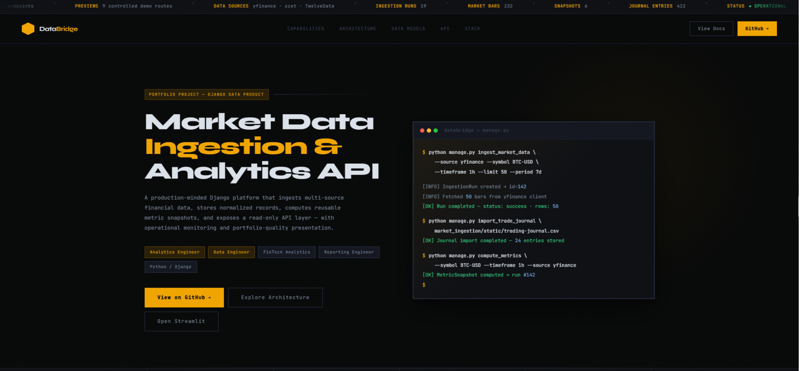
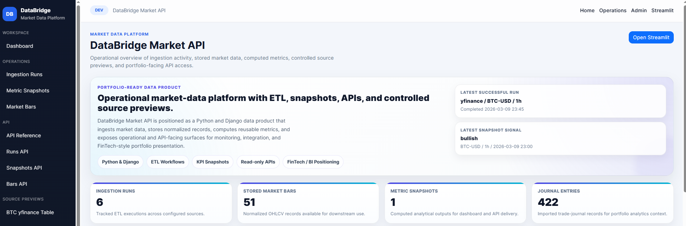
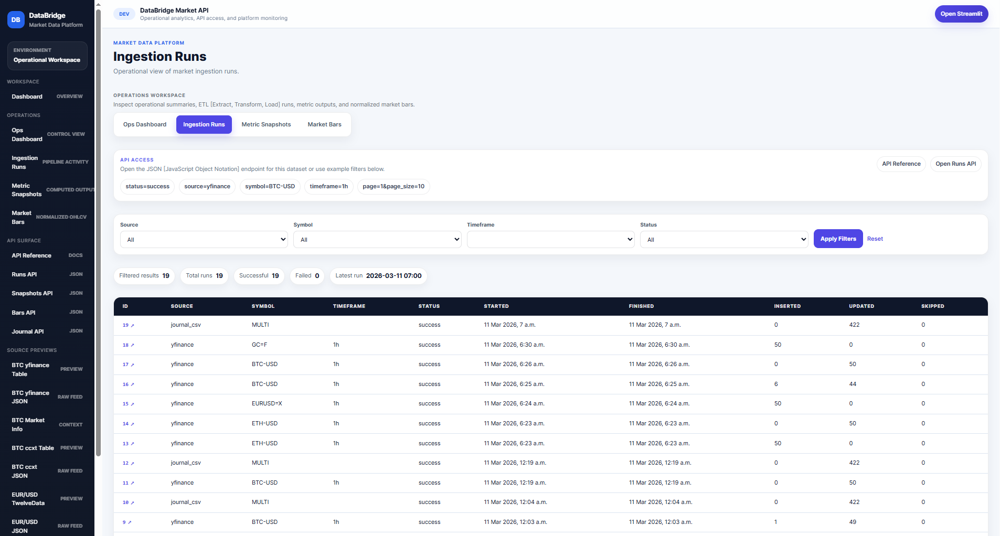
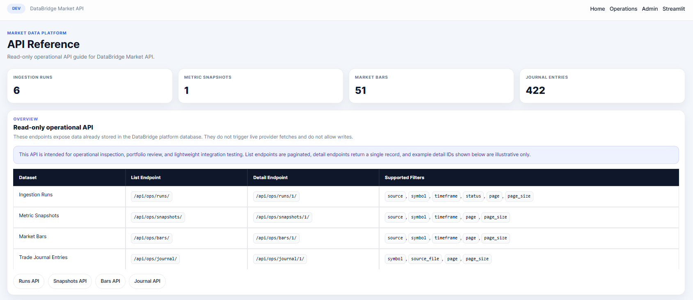
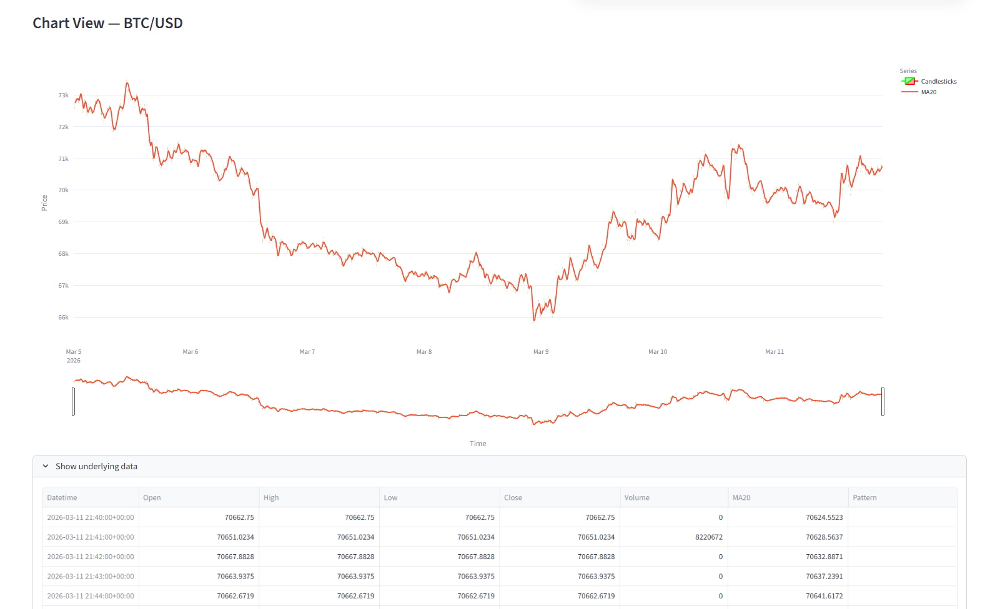

# DataBridge Market API

> A Django data product for multi-source market data ingestion, normalized storage, ETL [Extract, Transform, Load] workflows, operational visibility, and read-only API delivery — built to demonstrate Analytics Engineer, Data Engineer, FinTech, and BI [Business Intelligence] / reporting-oriented capability.

**Source ingestion → Normalized storage → Metric computation → Operational visibility → API delivery → Analytics consumption**

**Includes:** multi-source ingestion commands, normalized models, metric snapshots, operations UI, read-only JSON API, Streamlit output, and proof artifacts under `docs/`.

---

## For Hiring Managers

This project demonstrates the **upstream engineering side** of analytics work — not just charts and dashboards, but the full pipeline that makes them possible.

**Analytics Engineer / BI Engineer**
- Normalized relational model designed for downstream reporting
- Reusable metric snapshot computation (returns, volatility, SMA, crossover signals)
- Read-only API endpoints with filtering and human-readable reference docs
- Analyst-facing Streamlit output surface

**Data Engineer / Junior Integration Engineer**
- Three live provider integrations (yfinance, ccxt, TwelveData)
- Repeatable ETL workflows via Django management commands
- Full run observability: status, timestamps, row counts, and execution context logged per run

**The interview story in one sentence:**
> *"External market data from multiple providers flows through ingestion commands into a normalized store, metric snapshots are computed on demand, and everything is queryable via a read-only API with an ops monitoring UI."*

---

## Screenshots

### Public Landing Page


### Core Product Surfaces

| Executive Dashboard | Ingestion Runs |
|---|---|
|  |  |

| API Reference | Streamlit Dashboard |
|---|---|
|  |  |

### Additional Dashboard Proof

For a full-page view of the executive dashboard, see:

[Full executive dashboard screenshot](docs/screenshots/01.0_home_dashboard_full.png)

---

## Architecture

```
Provider Clients        Service Layer             Normalized Models
─────────────────       ──────────────────────    ──────────────────────
yfinance                ingestion.py              IngestionRun
ccxt              ──▶   journal_import.py   ──▶   MarketBar
TwelveData              metrics.py                MetricSnapshot
                                                  TradeJournalEntry
                                                         ↓
                        ETL Commands              Delivery Layer
                        ──────────────────────    ──────────────────────
                        ingest_market_data         /api/ops/   JSON endpoints
                        import_trade_journal  ──▶  /ops/       monitoring UI
                        compute_metrics            /portfolio/ public landing
                                                   /           exec dashboard
                                                   streamlit   analytics output
```

---

## How to Review This Project

**1. Public landing page** — `/portfolio/`
Recruiter-facing overview of capabilities, architecture, data models, API layer, and stack.

**2. Executive dashboard** — `/`
KPI-style operational summary, latest run state, and platform navigation.

**3. ETL execution history** — `/ops/runs/`
Ingestion run history with status, timestamps, and row-level execution tracking.

**4. API layer** — `/api/ops/reference/`
Human-readable documentation for all read-only JSON endpoints.

**5. Analyst-facing output** — `streamlit_app.py`
```bash
python -m streamlit run streamlit_app.py
```

**6. ETL commands directly**
```bash
python manage.py ingest_market_data --source yfinance --symbol BTC-USD --timeframe 1h --limit 50 --period 7d
python manage.py import_trade_journal market_ingestion/static/trading-journal.csv
python manage.py compute_metrics --symbol BTC-USD --timeframe 1h --source yfinance --run-id <RUN_ID>
```

**7. Proof artifacts** — `docs/STATUS.md`, `docs/PROOF_INDEX.md`, `docs/screenshots/`

---

## Core Models

**`IngestionRun`** — ETL execution metadata: source, symbol, timeframe, status, row counts, timestamps, and execution context.

**`MarketBar`** — Normalized OHLCV records linked to an ingestion run for downstream analytics and operational inspection.

**`MetricSnapshot`** — Computed analytics outputs: return windows, volatility, SMA fast/slow values, and crossover signals.

**`TradeJournalEntry`** — Imported journal data for portfolio analytics context, inspection views, and comparison workflows.

---

## ETL Commands

```bash
# Ingest market data
python manage.py ingest_market_data \
  --source yfinance \
  --symbol BTC-USD \
  --timeframe 1h \
  --limit 50 \
  --period 7d

# Import trade journal
python manage.py import_trade_journal market_ingestion/static/trading-journal.csv

# Compute metric snapshot
python manage.py compute_metrics \
  --symbol BTC-USD \
  --timeframe 1h \
  --source yfinance \
  --run-id <RUN_ID>
```

---

## API Endpoints

All endpoints are read-only and support query parameter filtering.

| Method | Endpoint | Description |
|--------|----------|-------------|
| GET | `/api/ops/reference/` | Human-readable API documentation |
| GET | `/api/ops/runs/` | Ingestion run list — filter by source, status, symbol |
| GET | `/api/ops/runs/<id>/` | Ingestion run detail |
| GET | `/api/ops/snapshots/` | Metric snapshot list — filter by symbol, timeframe |
| GET | `/api/ops/bars/` | Market bar OHLCV records — filter by symbol, timeframe |
| GET | `/api/ops/journal/` | Trade journal entries — filter by source_file |

---

## Product Surfaces

| Route | Surface | Purpose |
|-------|---------|---------|
| `/` | Executive dashboard | KPI summary, latest run state, navigation |
| `/portfolio/` | Public landing page | Recruiter-facing project overview |
| `/ops/` | Operations UI | ETL run history, snapshots, bars, platform state |
| `/api/ops/` | Read-only API | JSON endpoints with filtering and detail routes |
| `/demo/` | Source previews | Controlled provider proof routes |
| `streamlit_app.py` | Analytics surface | Analyst-facing chart and market-view output |

---

## Local Setup

### 1. Install dependencies

```bash
pip install -r requirements.txt
```
### 2. Configure environment

Copy `.env.example` to `.env` and fill in:

- `DJANGO_SETTINGS_MODULE`
- `TWELVEDATA_API_KEY`
- `STREAMLIT_URL`
- `CCXT_EXCHANGE`

```bash
# 3. Run Django
python manage.py migrate
python manage.py runserver

# 4. Run Streamlit (optional)
python -m streamlit run streamlit_app.py

# 5. Verify
python manage.py check
python manage.py test
```

> TwelveData preview pages require a valid `TWELVEDATA_API_KEY` in `.env`. Real secrets must never be committed.

---

## Tech Stack

| Layer | Technology |
|-------|------------|
| Backend | Python / Django |
| Market data | yfinance |
| Crypto data | ccxt |
| Financial API | TwelveData |
| Analytics UI | Streamlit |
| Database | SQLite (dev) / PostgreSQL (production target) |
| Testing | Django TestCase |

---

## Project Structure

```
databridge-market-api/
├── manage.py
├── requirements.txt
├── .env.example
├── streamlit_app.py
├── databridge/
│   ├── urls.py
│   └── settings/
│       ├── base.py
│       ├── dev.py
│       └── prod.py
├── market_ingestion/
│   ├── clients/
│   │   ├── yfinance_client.py
│   │   ├── ccxt_client.py
│   │   └── twelvedata_client.py
│   ├── services/
│   │   ├── ingestion.py
│   │   ├── journal_import.py
│   │   └── metrics.py
│   ├── management/commands/
│   │   ├── ingest_market_data.py
│   │   ├── import_trade_journal.py
│   │   └── compute_metrics.py
│   ├── models.py
│   ├── views.py
│   ├── api_views.py
│   └── api_urls.py
└── docs/
    ├── STATUS.md
    ├── PROOF_INDEX.md
    └── screenshots/
```
